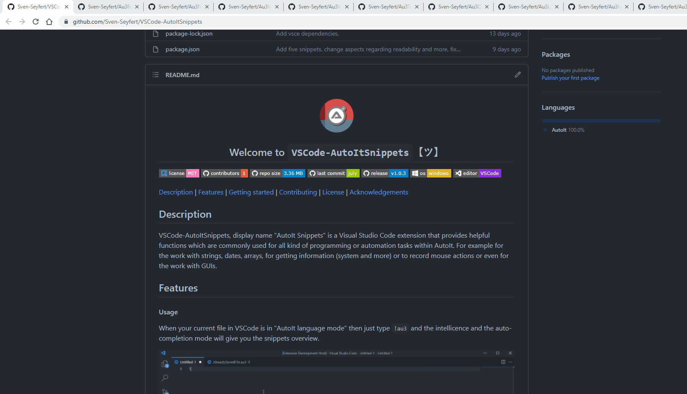

#####

    
    <h2 align="center">Welcome to <code>Au3BrowserTabScroll</code>【ツ】</h2>

[Description](#description) | [Features](#features) | [Getting started](#getting-started) | [Configuration](#configuration) | [Keyboard shortcuts](#keyboard-shortcuts) | [Contributing](#contributing) | [License](#license) | [Acknowledgements](#acknowledgements)

## Description

Au3BrowserTabScroll is a small helper tool which allows scrolling through your browser tabs. You can scroll between the tabs by the mouse wheel in Chrome and Firefox.

## Features

Simply scroll through your browser tabs by the mouse wheel.

**In Chrome:**

**In Firefox:**

## Getting started

#### *Preconditions*

A computer mouse with a mouse wheel 😄 .

#### *Installation*

**Variant 1 - Run the EXE**

Starting the EXE `build\Au3BrowserTabScroll.exe` which is compiled with `#AutoIt3Wrapper_UseX64=y` and `#AutoIt3Wrapper_UseUpx=n` (the default expected system is x64).

**Variant 2 - Compile it on your own**

Open file `src\Au3BrowserTabScroll.au3`, adjust the *#AutoIt3Wrapper compiler information* if you want to. For example you could change `#AutoIt3Wrapper_UseUpx=n` from no (n) to yes (y), etc.
Then, run or compile the program.

#### *Usage*

The scroll action only works if your mouse cursor position is on the very top of the browser. This is the indicator for the programm that it should scroll through the tabs, otherwise it would scroll the content of the page/tab (default behavior of the browser).

## Configuration

No configuration needed.

## Keyboard shortcuts

| Action | Shortcut   |
| :---   | :---       |
| Exit   | `Ctrl+F10` |

## Contributing

Just look at [CONTRIBUTING](https://github.com/Sven-Seyfert/Au3BrowserTabScroll/blob/main/docs/CONTRIBUTING.md), thank you!

## License

Distributed under the MIT License. See [LICENSE](https://github.com/Sven-Seyfert/Au3BrowserTabScroll/blob/main/LICENSE.md) for more information.

## Acknowledgements

- Opportunity by [GitHub](https://github.com)
- Badges by [Shields](https://shields.io)
- Utilities components by
  - none

##

[To the top](#)
